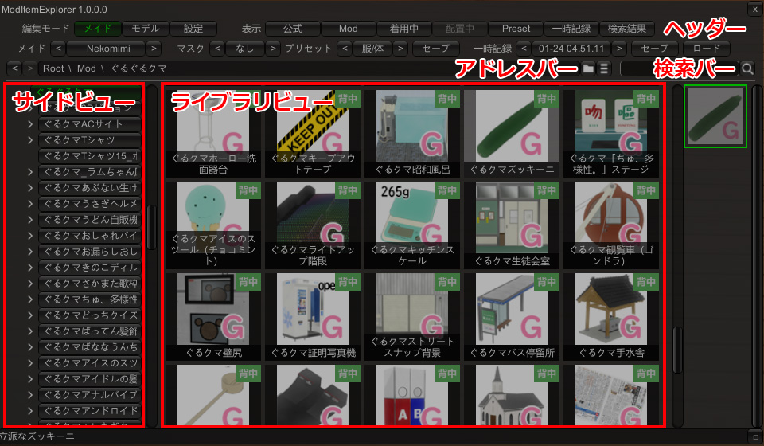

# COM3D2.ModItemExplorer.Plugin

v1.1.0.0


- [COM3D2.ModItemExplorer.Plugin](#com3d2moditemexplorerplugin)
  - [概要](#概要)
  - [インストール方法](#インストール方法)
  - [起動方法](#起動方法)
  - [必須プラグイン](#必須プラグイン)
  - [推奨プラグイン](#推奨プラグイン)
  - [機能一覧](#機能一覧)
  - [機能詳細](#機能詳細)
    - [ヘッダー](#ヘッダー)
      - [メイド衣装ヘッダー](#メイド衣装ヘッダー)
      - [モデル配置ヘッダー](#モデル配置ヘッダー)
    - [アドレスバー](#アドレスバー)
    - [検索バー](#検索バー)
    - [サイドビュー](#サイドビュー)
    - [ライブラリビュー](#ライブラリビュー)
    - [フッター](#フッター)
    - [設定画面](#設定画面)
  - [変更履歴](#変更履歴)
    - [2025/01/26 v1.1.0.0](#20250126-v1100)
    - [2025/01/25 v1.0.0.2](#20250125-v1002)
    - [2025/01/25 v1.0.0.1](#20250125-v1001)
    - [2025/01/24 v1.0.0.0](#20250124-v1000)
  - [規約](#規約)
    - [MOD規約](#mod規約)
    - [プラグイン開発者向け](#プラグイン開発者向け)


## 概要

Modアイテム用のファイラーです。

メイドの衣装切り替え、モデル配置などが可能です。

https://github.com/user-attachments/assets/7ae1772f-b8cf-4d72-8587-7fb77fd6707b


## インストール方法

[Releases](https://github.com/kidonaru/COM3D2.ModItemExplorer.Plugin/releases)
から最新の`COM3D2.ModItemExplorer.Plugin-vX.X.X.zip`をダウンロードします。

zip解凍後、`UnityInjector`フォルダの中身を、`Sybaris\UnityInjector`フォルダに配置してください。

各ファイルの説明:
- `COM3D2.ModItemExplorer.Plugin.dll`
  - プラグインの本体。
- `Config/ModItemExplorer_OfficialName.csv`
  - 公式のフォルダ名称一覧ファイル

COM3D2 Ver.2.38.0で動作確認済みです。


## 起動方法

ゲーム起動後、`Alt` + `M`キーを押すと、プラグインが有効になります。
（`Config/ModItemExplorer.xml`を編集することでキーの変更も可能です）

初回有効化時、menuファイルのキャッシュを作成するため、ロードに時間がかかります。
別スレッドで処理をしているので、ロード中も操作可能です。


## 必須プラグイン

拡張プリセットの読み込みに以下のプラグインが必要です。

- COM3D2.ExternalPreset
- COM3D2.ExternalSaveData


## 推奨プラグイン

MotionTimelineEditorプラグインが入っている場合、モデル配置が可能になります。
（入っていない場合でもメイドの衣装切り替えは可能です）

- **COM3D2.MotionTimelineEditor.Plugin**
  - https://github.com/kidonaru/COM3D2.MotionTimelineEditor.Plugin

モデル配置機能には別途モデル配置プラグイン（複数メイド、MeidoPhotoStudio、SceneCapture）のいずれかが必要になります。
MotionTimelineEditorのREADMEを参考に導入してください。


## 機能一覧

- メイドの衣装切り替え、モデル配置
- Modフォルダ以下のアイテムをフォルダ単位で表示
- サイドビューでフォルダ構造の表示、移動
- プリセットの保存、読み込み、一時記録
  - Modフォルダ以下のプリセットにも対応しています
  - Presetフォルダ以下は、メイド毎にグループ化して表示します
- プリセットの一時記録
  - 着用中のアイテムをメモリ上に一時保存する機能です
- 指定フォルダ以下のアイテム検索
- menuのキャッシュ
  - 初回プラグイン有効化時、全てのmenuファイルを読み込んでキャッシュします
  - 2回目以降はキャッシュを利用するため、ロードが早くなります
  - menuを更新した場合は、更新日時を比較して自動でキャッシュの再生成を行います
- 別スレッドでのロード
  - ファイルのロードは別スレッドで行うため、ロード中も操作可能です
  - サムネ、プリセットは表示時に動的ロードしています
- 重複ファイルの検出


## 機能詳細



### ヘッダー

- **編集モード**: モード切り替え
  - **メイド**: メイド衣装の編集モードに切り替えます
  - **モデル**: モデルの配置モードに切り替えます
  - **設定**: プラグインの設定画面を開きます
- **表示**: 表示する場所の指定
  - **公式**: 公式アイテムを表示します
  - **Mod**: Modフォルダ以下のアイテムを表示します
  - **着用中**: 現在メイドが着用しているアイテム一覧を表示します
  - **配置中**: 現在配置しているモデル一覧を表示します
  - **Preset**: Presetフォルダ以下のプリセット一覧を表示します
  - **一時記録**: 一時保存したプリセットを表示します
  - **検索結果**: 検索結果を表示します

#### メイド衣装ヘッダー

メイド衣装の編集モード時に表示されます。

- **メイド**: 操作対象のメイドの選択
- **マスク**: メイドのマスク設定
  - **なし**: 全ての衣装を表示します
  - **下着**: 下着のみ表示します
  - **水着**: 水着のみ表示します
  - **裸**: すべての衣装を非表示にします
- **プリセット**: プリセットの種類を選択
  - **服**: メイドの服装のみを保存します
  - **体**: メイドの体型のみを保存します
  - **服/体**: メイドの服装、体型を保存します
- **セーブ**: プリセットの保存
- **一時記録**: 対象の一時記録を選択
  - 着用中のアイテムを一時的に保存することができます
  - **セーブ**: 一時記録の保存
  - **ロード**: 一時記録のロード

#### モデル配置ヘッダー

モデル配置モード時に表示されます。

- **配置プラグイン**: 配置に使用するプラグインの選択
- **配置**: 選択したモデルを配置


### アドレスバー

現在表示している場所のパスを表示します。
各フォルダ名をクリックすると、そのフォルダに移動します。

- **<**: 一つ前に表示していた場所に戻ります
- **>**: 次に進みます
- **フォルダアイコン**: OSのエクスプローラーでフォルダを開きます
- **リストアイコン**: フラットビューの切り替えが可能
  - フラットビューを有効にすると、サブフォルダの中身を展開してすべてのアイテムを一覧で表示します

### 検索バー

表示中のフォルダ以下のアイテムを検索します。


### サイドビュー

フォルダ構造の表示、移動が可能です。
`>`をクリックすると、中身を展開してサブフォルダを表示します。


### ライブラリビュー

選択したフォルダ内のアイテム、サブフォルダを表示します。

着用中のアイテムは緑枠で表示されます。アイコン左上の`x`ボタンをクリックすると、アイテムを外すことができます。`☆`ボタンをクリックすると、お気に入りに登録することができます。

メイド編集モード時には、アイテムをクリックするとメイドに着用させることができます。
モデル配置モード時には、アイテムをクリックするとモデルを選択し、`配置`ボタンをクリックすると配置することができます。

`Shift`キーを押しながらアイテムをクリックすると、格納されているフォルダをOSのエクスプローラーで開くことができます。


### フッター

マウスオーバー時にアイテムの詳細を表示します。

- **□**: ドラッグしてウィンドウサイズを変更できます


### 設定画面


- **公式アイテムをMPN毎に表示する**: 公式アイテムをMPN毎にグループ化して表示します
  - チェックを外した場合、menuのパス毎に表示します
- **ModアイテムをMPN毎に表示する**: ModアイテムをMPN毎にグループ化して表示します
  - チェックを外した場合、格納フォルダのパス毎に表示します
- **プリセットをメイド毎に表示する**: プリセットをメイド毎にグループ化して表示します
- **アイテム選択時に詳細ログ表示**: アイテムを選択した際に、アイテムの詳細をログに表示します
- **アイテム名 背景透過度**: アイテム名の背景の透過度を設定します
- **タグ 背景透過度**: タグの背景の透過度を設定します
- **フラットビューの基本アイテム数**: 選択フォルダ内の合計アイテム数がこの数以下の場合に、デフォルトでフラットビューにします
- **重複ファイルチェック**: 重複ファイルを検出します。チェックを入れた拡張子が対象になります
  - **出力**: 重複ファイルを検出したファイルパスを出力します
- **アイテム更新**: アイテム一覧を更新します
- **設定をリセット**: 設定を初期化します
- **キャッシュを再構築**: menuのキャッシュを再構築します


## 変更履歴


### 2025/01/26 v1.1.0.0

- お気に入り機能追加
- キャッシュサイズが小さくなった場合ロード時にクラッシュしていたのを修正
  - ※アップデートでキャッシュの再生成が走ります


### 2025/01/25 v1.0.0.2

- 特定の環境でログが大量に出力されるバグの修正
- キャッシュ再構築時に公式menuが読み込めないバグの修正


### 2025/01/25 v1.0.0.1

- Modフォルダ以下のプリセットと、一時記録の拡張プリセット対応
- タグのセット系名称を省略


### 2025/01/24 v1.0.0.0

- 公開版リリース


## 規約

### MOD規約

※MODはKISSサポート対象外です。
※MODを利用するに当たり、問題が発生してもKISSは一切の責任を負いかねます。
※「カスタムメイド3D2」か「カスタムオーダーメイド3D2」か「CR EditSystem」を購入されている方のみが利用できます。
※「カスタムメイド3D2」か「カスタムオーダーメイド3D2」か「CR EditSystem」上で表示する目的以外の利用は禁止します。
※これらの事項は http://kisskiss.tv/kiss/diary.php?no=558 を優先します。


他の機能追加などをしたい場合は、リポジトリを公開しているのでこちらにPRをお願いします。
https://github.com/kidonaru/COM3D2.ModItemExplorer.Plugin

質問、要望などは@kidonaruまで (可能な範囲で対応します)
https://twitter.com/kidonaru


### プラグイン開発者向け

このプラグインの開発に手伝っていただける場合、下記手順でプルリクエストを送信してください。

1. このリポジトリをフォークします

2. フォークしたリポジトリを、ローカルの`COM3D2\Sybaris`以下にクローン
```bash
cd [COM3D2のインストールフォルダ]\Sybaris
git clone https://github.com/[自分のユーザー名]/COM3D2.ModItemExplorer.Plugin.git
```

3. クローンしたフォルダをVS Codeなどで開く

4. コード修正後、デバッグ用ビルドスクリプトを実行し動作確認
(自動でUnityInjector内にコピーされます)
```bash
.\debug.bat
```

5. 差分をリモートにプッシュして、フォーク元に対してプルリクエストを送信
