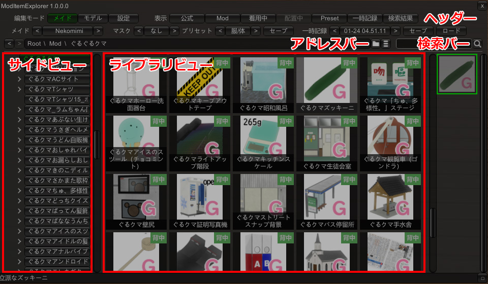
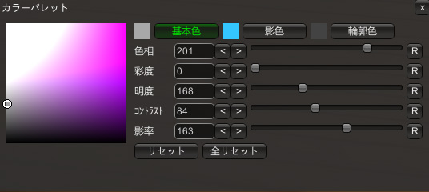
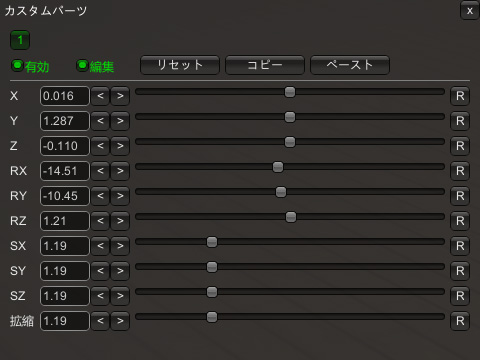
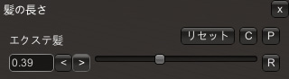
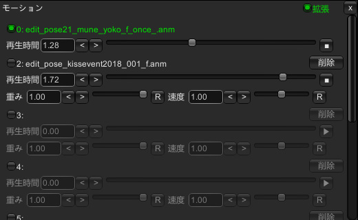

# COM3D2.ModItemExplorer.Plugin

v2.2.0.0


- [COM3D2.ModItemExplorer.Plugin](#com3d2moditemexplorerplugin)
  - [概要](#概要)
  - [インストール方法](#インストール方法)
  - [起動方法](#起動方法)
  - [必須プラグイン](#必須プラグイン)
  - [推奨プラグイン](#推奨プラグイン)
  - [機能一覧](#機能一覧)
  - [機能詳細](#機能詳細)
    - [ヘッダー](#ヘッダー)
      - [メイド衣装ヘッダー](#メイド衣装ヘッダー)
      - [モデル配置ヘッダー](#モデル配置ヘッダー)
    - [アドレスバー](#アドレスバー)
    - [検索バー](#検索バー)
    - [サイドビュー](#サイドビュー)
    - [ライブラリビュー](#ライブラリビュー)
    - [フッター](#フッター)
    - [設定画面](#設定画面)
    - [カラーパレットウィンドウ](#カラーパレットウィンドウ)
    - [カスタムパーツウィンドウ](#カスタムパーツウィンドウ)
    - [髪の長さウィンドウ](#髪の長さウィンドウ)
    - [モーションウィンドウ](#モーションウィンドウ)
    - [モデル操作ウィンドウ](#モデル操作ウィンドウ)
  - [変更履歴](#変更履歴)
    - [2026/08/22 v2.2.0.0](#20260822-v2200)
    - [2026/08/20 v2.1.0.0](#20260820-v2100)
    - [2026/08/16 v2.0.0.0](#20260816-v2000)
    - [2026/08/10 v1.8.1.0](#20260810-v1810)
    - [2026/08/09 v1.8.0.1](#20260809-v1801)
    - [2026/08/08 v1.8.0.0](#20260808-v1800)
    - [2025/07/06 v1.7.0.1](#20250706-v1701)
    - [2025/06/07 v1.7.0.0](#20250607-v1700)
    - [2025/04/09 v1.6.0.1](#20250409-v1601)
    - [2025/04/06 v1.6.0.0](#20250406-v1600)
    - [2025/03/23 v1.5.0.0](#20250323-v1500)
    - [2025/02/15 v1.4.0.0](#20250215-v1400)
    - [2025/02/08 v1.3.0.0](#20250208-v1300)
    - [2025/02/02 v1.2.0.1](#20250202-v1201)
    - [2025/02/01 v1.2.0.0](#20250201-v1200)
    - [2025/01/26 v1.1.0.0](#20250126-v1100)
    - [2025/01/25 v1.0.0.2](#20250125-v1002)
    - [2025/01/25 v1.0.0.1](#20250125-v1001)
    - [2025/01/24 v1.0.0.0](#20250124-v1000)
  - [規約](#規約)
    - [MOD規約](#mod規約)
    - [プラグイン開発者向け](#プラグイン開発者向け)


## 概要

Modアイテム用のファイラーです。

検索機能付きでメイドの衣装切り替え、アイテムの配置が可能。

https://github.com/user-attachments/assets/7ae1772f-b8cf-4d72-8587-7fb77fd6707b


## インストール方法

[Releases](https://github.com/kidonaru/COM3D2.ModItemExplorer.Plugin/releases)
から最新の`COM3D2.ModItemExplorer.Plugin-vX.X.X.zip`をダウンロードします。

zip解凍後、お使いのゲームに対応したフォルダの中身を、`Sybaris\UnityInjector`フォルダに配置してください。

- COM3D2 の場合: `UnityInjector`フォルダ
- COM3D2.5 の場合: `UnityInjector (COM3D2.5)`フォルダ

※両方を同時に配置しないでください。dllの内容が異なるだけで、ファイル構成は同じです。

各ファイルの説明:
- `COM3D2.ModItemExplorer.Plugin.dll`
  - プラグインの本体。
- `Config/ModItemExplorer_OfficialName.csv`
  - 公式のフォルダ名称一覧ファイル

COM3D2 Ver.2.38.0、COM3D2.5 Ver.3.49.0で動作確認済みです。


## 起動方法

ゲーム起動後、執務室などで`Alt` + `M`キーを押すと、プラグインが有効になります。
（`Config/ModItemExplorer.xml`を編集することでキーの変更も可能です）

初回有効化時、menuファイルのキャッシュを作成するためロードに時間がかかります。
別スレッドで処理をしているので、ロード中も操作可能です。

エディット画面では重くなる可能性があるため、執務室で複数メイドやMeidoPhotoStudioを立ち上げた状態で使用することを推奨します。


## 必須プラグイン

拡張プリセットの読み込みに以下のプラグインが必要です。

- COM3D2.ExternalPreset
- COM3D2.ExternalSaveData


## 推奨プラグイン

モデル配置はプラグイン単体で利用できます（配置プラグイン`ModItemExplorer`）。

MotionTimelineEditorプラグインが入っている場合、配置プラグインとしてそちらも選択できるようになります。

- **COM3D2.MotionTimelineEditor.Plugin**
  - https://github.com/kidonaru/COM3D2.MotionTimelineEditor.Plugin

MotionTimelineEditor側の配置を使う場合は、別途モデル配置プラグイン（複数メイド、MeidoPhotoStudio、SceneCapture）のいずれかが必要になります。
MotionTimelineEditorのREADMEを参考に導入してください。


## 機能一覧

- メイドの衣装切り替え、モデル配置、モーション再生
- プラグイン単体でのモデル配置
  - ギズモ／数値でのTransform編集、メイドへのアタッチ、配置プリセットに対応
- Modフォルダ以下のアイテムをフォルダ単位で表示
  - Mod内の背景オブジェクト(photo_bg_object_list.nei / .asset_bg)にも対応しています
- サイドビューでフォルダ構造の表示、移動
- お気に入り、履歴の記録
  - 適用したアイテム、配置したモデルを新しい順に履歴として記録します
- プリセットの保存、読み込み、一時記録
  - Modフォルダ以下のプリセットにも対応しています
  - Presetフォルダ以下は、メイド毎にグループ化して表示します
- プリセットの一時記録
  - 着用中のアイテムをメモリ上に一時保存する機能です
- 指定フォルダ以下のアイテム検索
- menuのキャッシュ
  - 初回プラグイン有効化時、全てのmenuファイルを読み込んでキャッシュします
  - 2回目以降はキャッシュを利用するため、ロードが早くなります
  - menuを更新した場合は、更新日時を比較して自動でキャッシュの再生成を行います
- 別スレッドでのロード
  - ファイルのロードは別スレッドで行うため、ロード中も操作可能です
  - サムネ、プリセットは表示時に動的ロードしています
- 重複ファイルの検出


## 機能詳細



### ヘッダー

- **編集モード**: モード切り替え
  - **メイド**: メイド衣装の編集モードに切り替えます
  - **モデル**: モデルの配置モードに切り替えます
  - **設定**: プラグインの設定画面を開きます
  - メイド/モデルの選択は記憶され、次回起動時は前回のモードで開きます
- **表示**: 表示する場所の指定
  - **Root**: 全カテゴリを一覧で表示します
  - **公式**: 公式アイテムを表示します
  - **Mod**: Modフォルダ以下のアイテムを表示します
  - **着用中**: 現在メイドが着用しているアイテム一覧を表示します
  - **配置中**: 現在配置しているモデル一覧を表示します
  - **Preset**: Presetフォルダ以下のプリセット一覧を表示します
  - **一時記録**: 一時保存したプリセットを表示します
  - **検索結果**: 検索結果を表示します
  - **お気に入り**: お気に入りに登録したアイテムを表示します
  - **履歴**: 適用したアイテム、配置したモデルを新しい順に表示します

#### メイド衣装ヘッダー

メイド衣装の編集モード時に表示されます。

- **メイド**: 操作対象のメイドの選択
- **サムネ更新**: 現在のメイドのサムネイルを更新します
- **マスク**: メイドのマスク設定
  - **なし**: 全ての衣装を表示します
  - **下着**: 下着のみ表示します
  - **水着**: 水着のみ表示します
  - **裸**: すべての衣装を非表示にします
- **プリセット**: プリセットの種類を選択
  - **服**: メイドの服装のみを保存します
  - **体**: メイドの体型のみを保存します
  - **服/体**: メイドの服装、体型を保存します
- **セーブ**: プリセットの保存
- **一時記録**: 対象の一時記録を選択
  - 着用中のアイテムを一時的に保存することができます
  - **セーブ**: 一時記録の保存
  - **ロード**: 一時記録のロード

#### モデル配置ヘッダー

モデル配置モード時に表示されます。

- **配置プラグイン**: 配置に使用するプラグインの選択
  - **ModItemExplorer**: 本プラグイン内蔵の配置機能を使用します
  - MotionTimelineEditorが入っている場合は、そちらの配置プラグインも選択できます
- **配置**: 選択したモデルを配置
  - `ModItemExplorer`での配置時は、カメラ注視点の真下に配置され、そのまま操作対象として選択されます
  - アイテムが未選択の場合は無効になります
  - アイテム、バリエーションのダブルクリックでも配置できます
- **操作**: [モデル操作ウィンドウ](#モデル操作ウィンドウ)の表示/非表示を切り替えます


### アドレスバー

現在表示している場所のパスを表示します。
各フォルダ名をクリックすると、そのフォルダに移動します。

- **<**: 一つ前に表示していた場所に戻ります
- **>**: 次に進みます
- **フォルダアイコン**: OSのエクスプローラーでフォルダを開きます
- **リストアイコン**: フラットビューの切り替えが可能
  - フラットビューを有効にすると、サブフォルダの中身を展開してすべてのアイテムを一覧で表示します
- **ソートアイコン**: アイテムのソート順を変更します
  - **基本**: カテゴリ/プライオリティでソートします
  - **名前**: アイテム名でソートします
  - **更新日時**: 更新日時でソートします


### 検索バー

表示中のフォルダ以下のアイテムを検索します。
入力が一定時間止まると自動で検索を実行します。


### サイドビュー

フォルダ構造の表示、移動が可能です。
`>`をクリックすると、中身を展開してサブフォルダを表示します。


### ライブラリビュー

選択したフォルダ内のアイテム、サブフォルダを表示します。

着用中のアイテムは緑枠で表示されます。アイコン左上の`x`ボタンをクリックすると、アイテムを外すことができます。`☆`ボタンをクリックすると、お気に入りに登録することができます。

メイド編集モード時には、アイテムをクリックするとメイドに着用させることができます。
モデル配置モード時には、アイテムをクリックするとモデルを選択し、`配置`ボタンをクリックすると配置することができます。アイテムをダブルクリックした場合は、選択と配置をまとめて行います。

`Shift`キーを押しながらアイテムをクリックすると、格納されているフォルダをOSのエクスプローラーで開くことができます。

ビュー内で右クリックすると、アドレスバーの`<`ボタンと同様に前のフォルダに戻ることができます。


### フッター

マウスオーバー時にアイテムの詳細を表示します。

- **□**: ドラッグしてウィンドウサイズを変更できます


### 設定画面


- **公式アイテムをMPN毎に表示する**: 公式アイテムをMPN毎にグループ化して表示します
  - チェックを外した場合、menuのパス毎に表示します
- **ModアイテムをMPN毎に表示する**: ModアイテムをMPN毎にグループ化して表示します
  - チェックを外した場合、格納フォルダのパス毎に表示します
- **アイテム選択時に詳細ログ表示**: アイテムを選択した際に、アイテムの詳細をログに表示します
- **メニューの説明欄も検索する**: メニューの説明欄も検索対象にします
- **アイテム名 背景透過度**: アイテム名の背景の透過度を設定します
- **タグ 背景透過度**: タグの背景の透過度を設定します
- **フラットビューの基本アイテム数**: 選択フォルダ内の合計アイテム数がこの数以下の場合に、デフォルトでフラットビューにします
- **履歴の最大保存数**: 履歴に残す件数の上限を設定します
  - **履歴をクリア**: 履歴を全て削除します
- **カスタムパーツ選択時の自動編集**: 選択したアイテムのカスタムパーツが有効な場合、自動で編集モードに切り替えます
- **カスタムパーツの移動範囲**: カスタムパーツの移動範囲を設定します
- **重複ファイルチェック**: 重複ファイルを検出します。チェックを入れた拡張子が対象になります
  - **出力**: 重複ファイルを検出したファイルパスを出力します
- **アイテム更新**: アイテム一覧を更新します
- **設定をリセット**: 設定を初期化します
- **キャッシュを再構築**: menuのキャッシュを再構築します


### カラーパレットウィンドウ



選択中のアイテムの無限色変更を行うことができます。

- **リセット**: 現在のカテゴリ色(基本色/影色/輪郭色)をリセットします
  - リセット時の色は、アイテム選択時点の色になります
- **全リセット**: 全カテゴリ色をリセットします


### カスタムパーツウィンドウ



選択中のアイテムの位置調整などができます。

- **有効**: カスタムを有効にします
- **編集**: カスタムパーツの編集モードに切り替えます
- **リセット**: アイテム選択時のパラメータにリセットします
- **コピー**: 現在のパラメータをコピーします
- **ペースト**: コピーしたパラメータをペーストします
- **X/Y/Z**: 位置調整
- **RX/RY/RZ**: 回転調整
- **SX/SY/SZ**: スケール調整


### 髪の長さウィンドウ



選択中のアイテムの髪の長さ調整ができます。

- **リセット**: 髪の長さをリセットします
- **C**: 現在の髪の長さをコピーします
- **P**: コピーした髪の長さをペーストします


### モーションウィンドウ



モーションの再生を制御できます。

- **拡張**: 有効にすると複数アニメレイヤーでの再生制御ができます
- **レイヤー選択**: チェックボックスでレイヤーを選択した状態でアイテムを選択すると、そのレイヤーでモーションを再生します
- **再生時間**: モーションの再生時間を指定します
- **重み**: モーションの重みを指定します
- **速度**: モーションの再生速度を指定します


### モデル操作ウィンドウ

配置プラグインに`ModItemExplorer`を選択している場合に、モデル配置モード中に表示されます。
配置したモデルの選択、Transform編集、プリセット管理ができます。

SceneEditorが導入されている場合、ギズモ・表示対象・Transform・アタッチの各行はSceneEditorのInspector側に表示され、このウィンドウはモデル一覧の表示に専念します。

https://github.com/user-attachments/assets/6a24b179-7dab-4570-bdf0-d7d71e2d13a1

- **x**: ウィンドウを閉じます（モデル配置ヘッダーの`操作`ボタンで再表示できます）
- **□**: 右下をドラッグしてウィンドウサイズを変更できます
- **リセット**: 配置したモデルを全て削除します（確認ダイアログが表示されます）

**操作タブ**

- **モデル一覧**: 配置中のモデルをサムネ付きで表示します
  - **チェックボックス**: モデルの表示/非表示を切り替えます
  - **モデル名**: クリックで操作対象として選択します（選択中は緑色）。再度クリックすると選択を解除します
  - **x**: モデルを削除します
  - 選択中のモデルは、シーン上で色のフェードによりハイライトされます
- **ギズモ**: シーン上のギズモの操作種別を選択します
  - **なし** / **移動** / **回転** / **拡縮**
  - ギズモはモデル配置モード中のみ表示されます
  - 操作はハンドルを掴んだ場合のみ有効で、ウィンドウ上の操作とは干渉しません
- **表示対象**: ギズモを表示するモデルを選択します
  - **すべて表示**: 配置中の全モデルにギズモを表示します
  - **選択中**: 選択中のモデルのみギズモを表示します
- **位置 / 回転 / 拡縮**: 選択中のモデルのTransformを編集します
  - `X`/`Y`/`Z`のラベルを左右にドラッグするか、数値を直接入力して変更します
  - **R**: その項目を初期値にリセットします
- **XYZ連動**: 有効にすると、拡縮の1軸の変更を元の比率を保ったまま全軸に反映します
- **アタッチ**: 選択中のモデルを編集中のメイドの部位に追従させます
  - 頭/首/胸/骨盤/肩/肘/手/腿/膝/足から選択できます
  - **なし**を選ぶとアタッチを解除します

**プリセットタブ**

配置中のモデル全体を名前付きプリセットとして保存できます。

- **名前**: 保存するプリセット名を入力します（一覧のプリセット名をクリックすると入力欄に反映されるため、同名での上書き保存ができます）
- **保存**: 現在の配置内容を保存します
- **読込**: プリセットを読み込みます
- **削除**: プリセットを削除します

プリセットは`UnityInjector\Config\ModItemExplorer\ModelPresets`以下にxmlファイルとして保存されます。


## 変更履歴


### 2026/08/22 v2.2.0.0

- MODの背景オブジェクト(photo_bg_object_list.nei / .asset_bg)に対応
  - neiで定義された背景オブジェクトを専用アイコン付きでツリーに表示するようになりました
  - モデルとして配置でき、プリセットやundo/redoでも復元されます
- 「履歴」カテゴリを追加
  - 適用したアイテムと配置したモデルを新しい順に記録するようになりました
  - 履歴はConfig/ModItemExplorer_History.xmlへ保存されます
- カテゴリの切り替えをタブからドロップダウンへ変更
  - 「検索結果」「Root」も選択肢に含めるようになりました
- 検索バーの入力が止まったら自動で検索するようになりました
- モデル配置の操作性を改善
  - アイテム一覧のダブルクリックでも配置できるようになりました
  - 配置時にモデル操作ウィンドウを前面に出すようになりました
  - アイテム未選択時は「配置」ボタンを無効化するようになりました
  - 編集モードを記憶し、次回起動時に前回のモードで開くようになりました
  - モデルのリセット確認を2度押しからポップアップへ変更しました
- SceneEditorとの連携を改善
  - 選択中のメイドの共有をModelSelectClient経由へ移行しました
  - SceneEditor使用時はモデル操作のInspector行をInspector側へ寄せるようにしました
- 背景オブジェクトのサムネイルがモデル操作ウィンドウで表示されない問題を修正
- menuのスロット名の大文字小文字の違いでモデル配置に失敗する問題を修正
- 履歴からの適用やダブルクリック配置で例外が発生する問題を修正


### 2026/08/20 v2.1.0.0

- SceneEditorとの連携を強化
  - 選択中のメイドをSceneEditorと共有するようになりました
  - 配置したモデルの一覧をSceneEditorへ提供するようになりました
  - SceneEditorのボーン編集などから本プラグインの配置モデルを対象にできます
- 公式アイテムが一覧に表示されないことがある問題を修正
  - ゲーム側のアイテム情報の構築完了を待ってから列挙するようにしました
  - 列挙に失敗した場合に読み込み中表示のままになる問題も修正しました
- 衣装を変更すると選択中のメイドが切り替わってしまう問題を修正
- 着用中のアイテムが一覧に見つからない場合に警告ログを出力するように


### 2026/08/16 v2.0.0.0

- ウィンドウのドッキングに対応
  - MotionTimelineEditor・SceneEditorの各ウィンドウと相互にドッキングできるようになりました
- 配置モデルのギズモを刷新
  - MotionTimelineEditor・SceneEditorと共通のギズモに移行し、操作感を統一しました
  - ギズモの表示対象（移動/回転/拡縮）を切り替えられるようになりました。設定は次回起動時にも引き継がれます
- SceneEditorとの連携を強化
  - モデル配置をSceneEditorのInspectorと双方向で同期するようになりました
  - モデルの配置時・選択時にSceneViewが対象へフォーカスするようになりました
  - SceneEditorのプリセット連携の仕様変更に追従しました
  - SceneEditorの有効/無効の切り替えに追従するようになりました
- モデル操作ウィンドウのタブ行右端にリセット（全削除）ボタンを追加
- 編集モードをモデルに戻したときにモデル操作ウィンドウを再表示するように
- アクセントカラーをシアンに統一


### 2026/08/10 v1.8.1.0

- 配置モデルにNPRShaderが適用されない問題を修正
- ウィンドウ外で開始したドラッグがウィンドウ上に入るとカメラ操作を中断する問題を修正


### 2026/08/09 v1.8.0.1

- COM3D2.5でギアメニューのアイコンが表示されない問題を修正


### 2026/08/08 v1.8.0.0

- COM3D2.5に対応
- プラグイン単体でのモデル配置に対応
  - 配置プラグインに`ModItemExplorer`を追加し、MotionTimelineEditorなしでもモデルを配置できるようになりました
  - モデル操作ウィンドウを新設し、モデル一覧・Transform編集・アタッチ・配置プリセットに対応
  - 移動/回転/拡縮のギズモ操作に対応
- COM3D2.5でボタン等の見た目が崩れる問題を修正
- モデルファイルが欠けたMODの適用でエラーになる問題を修正
- ライブラリビューの右クリックで前のフォルダに戻れるように
- ウィンドウ上にカーソルがある間はカメラ操作を無効化するように
- プリセット適用・セット適用・アイテム削除後に着用中表示が更新されない問題を修正


### 2025/07/06 v1.7.0.1

- FBフェイスでハイライトが片目にしか反映されないバグの修正


### 2025/06/07 v1.7.0.0

- 他のプラグインでモデル配置後に初期化するとクラッシュするバグの修正


### 2025/04/09 v1.6.0.1

- メイド読込中のエラー修正
- モーションウィンドウのUI調整


### 2025/04/06 v1.6.0.0

- 複数アニメレイヤーでのモーション再生対応
  - 複数同時にモーションを再生して、任意の重み/速度での再生が可能です
  - 最大8アニメレイヤーまで設定できます


### 2025/03/23 v1.5.0.0

- モーション読み込み対応
  - スタジオモードで再生できるモーションと、Modフォルダ以下のanmファイルが再生できます
- ルート以下の空ディレクトリをタブから開けるように修正


### 2025/02/15 v1.4.0.0

- 一部バリエーションのあるアイテムが表示されない問題を修正
  - 今回のアプデでキャッシュが再生成されます
- アイテムの名前/更新日時順ソート追加


### 2025/02/08 v1.3.0.0

- カスタムパーツの編集機能追加
- 髪の長さ調整機能追加
- バリエーションアイテム内も検索対象に追加
- メニューの説明欄も検索対象に追加
  - 重いのでデフォルトでは無効、設定画面から有効化可能です
- 非表示のメイドは選択できないように修正
- スタジオモードでBackgroundCustom.Pluginでの配置に対応


### 2025/02/02 v1.2.0.1

- カラーパレットの色相変更軽量化
- キャッシュ生成時の不要なログ削除


### 2025/02/01 v1.2.0.0

- カラーセット付きバリエーション(髪の毛など)に対応
  - バリエーション/カラーセットの切り替えは別ウィンドウ化しました
- サムネ更新ボタン追加
- カラーパレットウィンドウ追加
- 描画周り最適化

※キャッシュにカラー情報を追加するためアップデートでキャッシュの再生成が走ります


### 2025/01/26 v1.1.0.0

- お気に入り機能追加
- キャッシュ更新時にファイルサイズが小さくなった場合、ロード時にクラッシュしていたのを修正
  - ※アップデートでキャッシュの再生成が走ります


### 2025/01/25 v1.0.0.2

- 特定の環境でログが大量に出力されるバグの修正
- キャッシュ再構築時に公式menuが読み込めないバグの修正


### 2025/01/25 v1.0.0.1

- Modフォルダ以下のプリセットと、一時記録の拡張プリセット対応
- タグのセット系名称を省略


### 2025/01/24 v1.0.0.0

- 公開版リリース


## 規約

### MOD規約

※MODはKISSサポート対象外です。
※MODを利用するに当たり、問題が発生してもKISSは一切の責任を負いかねます。
※「カスタムメイド3D2」か「カスタムオーダーメイド3D2」か「CR EditSystem」を購入されている方のみが利用できます。
※「カスタムメイド3D2」か「カスタムオーダーメイド3D2」か「CR EditSystem」上で表示する目的以外の利用は禁止します。
※これらの事項は http://kisskiss.tv/kiss/diary.php?no=558 を優先します。


他の機能追加などをしたい場合は、リポジトリを公開しているのでこちらにPRをお願いします。
https://github.com/kidonaru/COM3D2.ModItemExplorer.Plugin

質問、要望などは@kidonaruまで (可能な範囲で対応します)
https://twitter.com/kidonaru


### プラグイン開発者向け

このプラグインの開発に手伝っていただける場合、下記手順でプルリクエストを送信してください。

1. このリポジトリをフォークします

2. フォークしたリポジトリを、ローカルの`COM3D2\Sybaris`以下にクローン
```bash
cd [COM3D2のインストールフォルダ]\Sybaris
git clone https://github.com/[自分のユーザー名]/COM3D2.ModItemExplorer.Plugin.git
```

3. クローンしたフォルダをVS Codeなどで開く

4. コード修正後、デバッグ用ビルドスクリプトを実行し動作確認
(自動でUnityInjector内にコピーされます)
```bash
.\debug.bat
```

5. 差分をリモートにプッシュして、フォーク元に対してプルリクエストを送信
